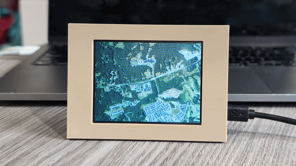

# pyportal-flyover

<p align="center">
  
</p>

A visualization for the Adafruit PyPortal displaying an animated flyover between any two locations (US only). Overhead aerial imagery captured along the route scrolls continuously across the screen, producing an uninterrupted, ever-changing view of the passing terrain.

This repository contains the source code for generating and displaying the flyover imagery, and CAD files for a 3D-printable PyPortal stand.

For a complete description and step-by-step build tutorial, visit the [PyPortal Flyover Viewer](https://www.hackster.io/rhammell/pyportal-flyover-viewer-1bc359) project on Hackster.io.

## Flyover Visualization

Displaying the animated flyover relies on two separate processes - generating a continuous strip of aerial imagery, and scrolling it across the PyPortal's screen. 

### Image Generation

The image strip is built by `generator/generate_flyover.py`, which runs on your computer. `START` and `END` set the route endpoints as (lat, lon) coordinates, and `ZOOM` sets the Web Mercator zoom level -- effectively the flight altitude. The script traces a straight line between the endpoints in Web Mercator (EPSG:3857) and downloads public-domain aerial imagery along that corridor from the [USGS National Map](https://basemap.nationalmap.gov/arcgis/rest/services/USGSImageryOnly/MapServer) export API (US coverage only).

The corridor is fetched in 1024-column chunks, one API call each. Every chunk is rotated so the direction of travel runs along the image's long axis, converted to RGB565, and appended to `output/flyover.dat`, stitching the chunks into one continuous strip. A preview image, `output/flyover.bmp`, is also written so the route can be inspected before deploying.

### Image Display

The flyover is displayed by `firmware/code.py`, which runs on the PyPortal and reads `flyover.dat` from an SD card in the PyPortal's card slot. `STEP` and `TARGET_FPS` set the pan speed (STEP x TARGET_FPS px/s). Since the data file is far larger than the PyPortal's RAM, it is never loaded whole -- the script streams it one 480-byte column at a time into a reusable buffer, keeping memory use constant for any route length.

For smooth animation, the script drives the ILI9341 display controller directly and uses its hardware scrolling: after the first screenful is drawn, each frame just bumps the scroll register and writes the newly exposed columns, synced to vertical blanking for tear-free panning. Each completed flight fades the backlight out, resets, and fades back in, and touching the screen cycles through preset brightness levels.

## Repo Layout

```text
firmware/     code.py, copied to the CIRCUITPY drive
generator/    flyover generator + requirements (outputs to generator/output/)
cad/          stand design (src/ = editable CAD, export/ = printable STL exports)
img/          README hero image
```

## Usage

Set up a Python environment and install the generator's dependencies (one time):

```bash
python3 -m venv .venv
.venv/bin/pip install -r generator/requirements.txt
```

Generate the flyover image data by running the generator script, after editing `START`, `END`, and `ZOOM` at the top of the script to define the route:

```bash
.venv/bin/python generator/generate_flyover.py
```

Preview the route in `generator/output/flyover.bmp`, then deploy in two steps. 

First, copy the image strip data to the root of a FAT32-formatted micro SD card (ex. volume name FLYOVER) and insert the card into the PyPortal's SD slot:

```bash
cp generator/output/flyover.dat /Volumes/FLYOVER/
```

Then copy the firmware code to the PyPortal's CIRCUITPY drive, and create the `sd` folder the card gets mounted onto (one-time setup, required by CircuitPython):

```bash
cp firmware/code.py /Volumes/CIRCUITPY/
mkdir -p /Volumes/CIRCUITPY/sd
```

The PyPortal auto-reloads and starts the flyover. The SD card must be inserted before the PyPortal powers on, since the card is mounted at startup.
